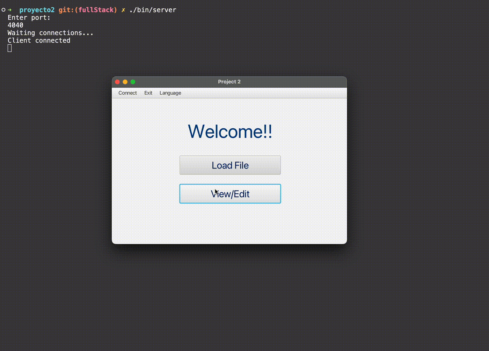
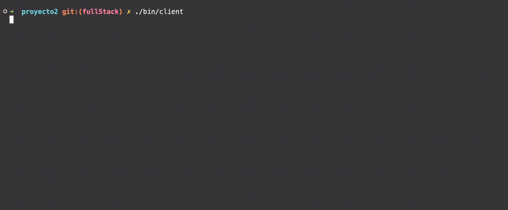
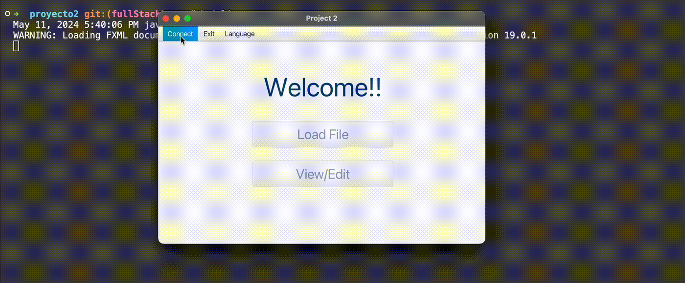

# File/Text editor based on Java servers and a JavaFX user interface.

This project indents to act as a small Cloud Storage Service where users can make simple changes using the integrated text editor.
On the server-side we use Java servers to deploy a simple server using a computer as a host. The host and the client can be deployed on the same computer. However if another device wants to connect to the same port, both devices
have to share the same network and have firewalls disabled.

Additional note: This project supports Unix based systems. Windows in **not** suported.

## Demo



## Requirements:

- JDK 20
- Maven 3.8.6

## To install the project:

1. Clone the repository.
2. Navigate to the project directory in your terminal.
3. Run `mvn install` to install the necessary libraries such as javaFX.

## To run the Server:

```bash
./bin/server
```

This will show a prompt inside the terminal asking for a port number. Please use a port between **1024** and **65535**.

The server has to be running at all times when using the client.


## To run the client:

```bash
./bin/client
```

This will start the client side application.

Once the application starts running, you have to connect to the server to be able to access the documents.
To do this:

1. Click on the Connect button located in the top bar.
2. In the address prompt: If running locally, enter **_localhost_**. Otherwise, enter the IP address of the server.
   

3. In the port prompt: Enter the server port (the one you chose when deploying the server).
4. Click connect

## Features:

- Changes are made in real-time.
- Server contains change logs, server logs and event logs. These can be accessed through the **./logs** folder.
- All files modified by the client will be saved in the **./drive** folder that the server has.
- Support for multiple languages.
